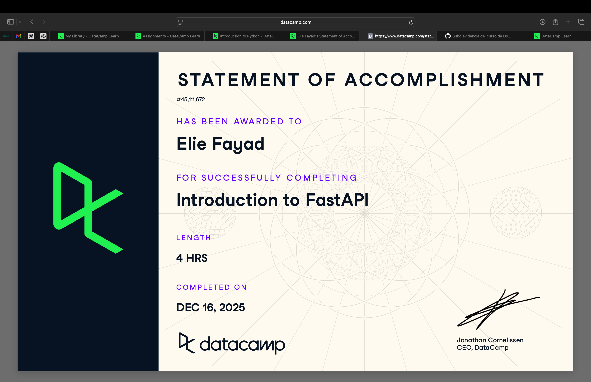

# Docker (Proyecto del módulo de docker)

- Nombre: Elie Joseph Fayad El Haddad
- Usuario de GitHub: Eliefaya   
- Fecha de entrega: 15/Diciembre/2025

El curso esta en Datacamp en el grupo, revisa como entrar esta como tarea asignada del datacamp.
## Evidencia
- Link(s): https://www.datacamp.com/statement-of-accomplishment/course/5e1673090f0b7c38b5c3e3d585b025894619f155?raw=1
- Captura(s):

> Debe aparecer tu nombre o usuario de GitHub de forma clara. Si eliges la opción de Data Camp, sube evidencia de ambos cursos.

