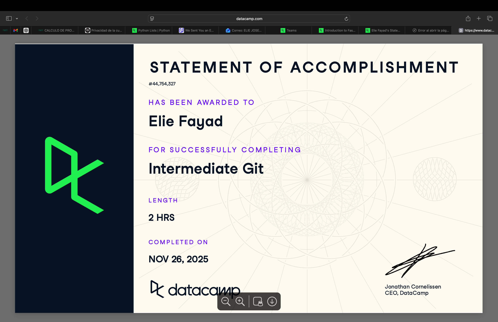

# Github (Proyecto del Modulo de github)

- Nombre: Elie Joseph Fayad El Haddad 
- Usuario de GitHub: Eliefaya
- Fecha de entrega: 26 noviembre 2025

## Curso elegido (marca uno)
- [ ] Udemy: https://www.udemy.com/course/git-expert-4-hours/
- [x] Data Camp: https://app.datacamp.com/learn/skill-tracks/github-foundations

## Evidencia
- Link(s): https://www.datacamp.com/statement-of-accomplishment/course/3d24bc55b0566d028a31c24c699fa4a672d6d172?raw=1
- Captura(s): 

> Debe aparecer tu nombre o usuario de GitHub de forma clara.

