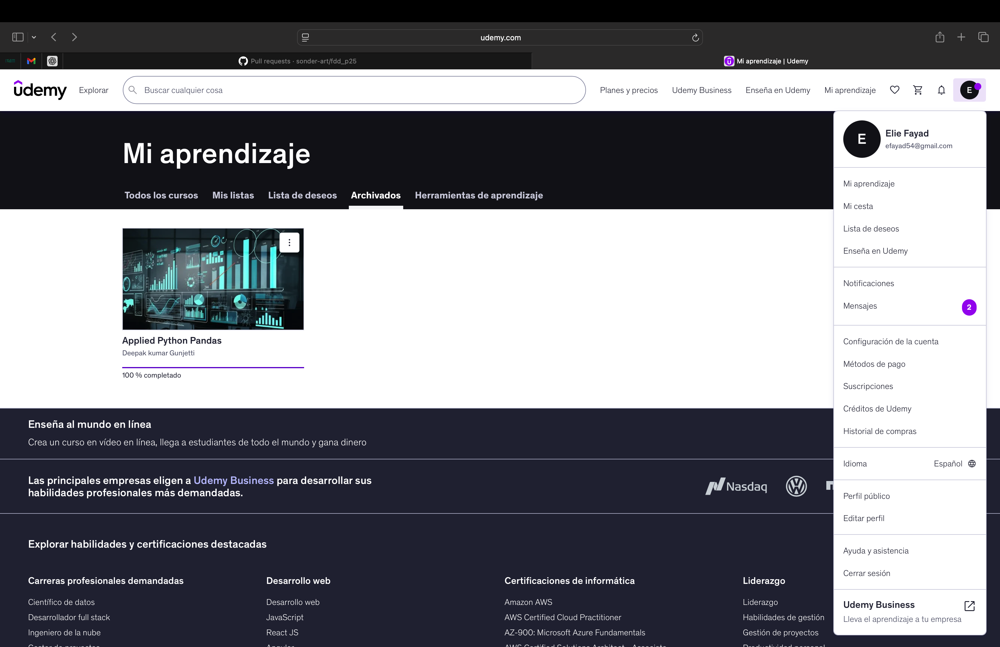

# Pandas (Proyecto modulo de Pandas)

- Nombre: Elie Joseph Faydad El Haddad 
- Usuario de GitHub: Eliefaya
- Fecha de entrega: 

## Curso elegido (marca uno)
- [ ] Udemy: https://www.udemy.com/course/learn-data-wrangling-using-python-and-pandas-free-course/
- [X] Udemy: https://www.udemy.com/course/applied-python-pandas/
- [ ] Data camp: https://app.datacamp.com/learn/courses/data-manipulation-with-pandas

## Evidencia
- Link(s): https://www.udemy.com/home/my-courses/archived/
- Captura(s): 

> Debe aparecer tu nombre o usuario de GitHub de forma clara.

