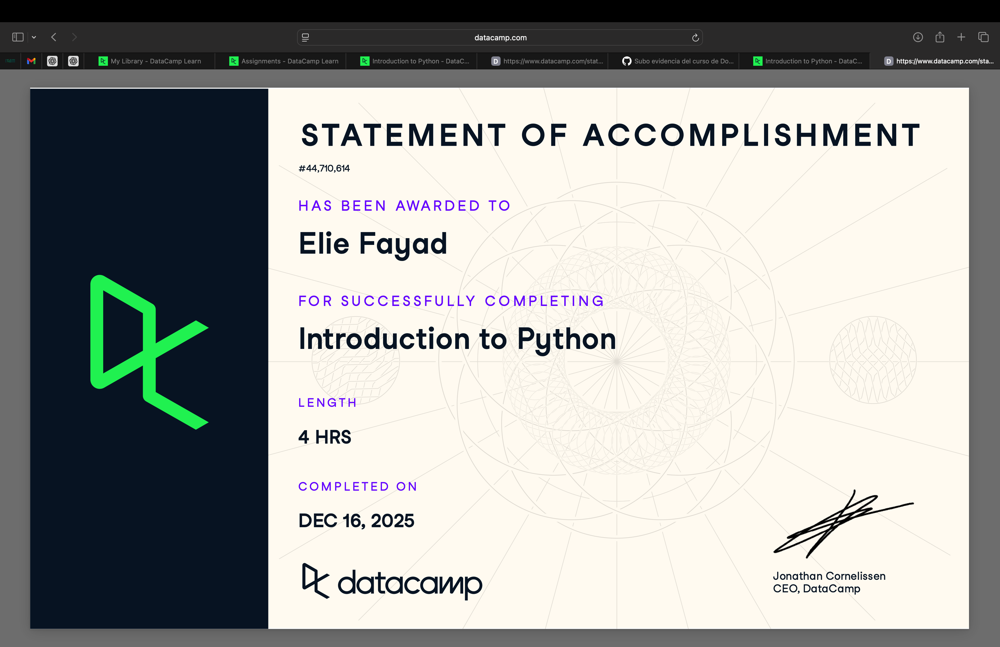
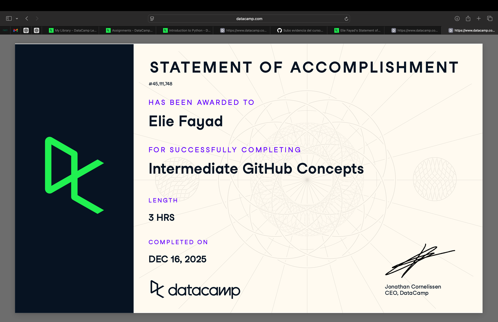

# Python (Proyecto del modulo de python)

- Nombre: Elie Joseph Fayad El Haddad
- Usuario de GitHub: Eliefaya   
- Fecha de entrega: 15/Diciembre/2025

## Curso elegido (marca uno)
- [x] Data Camp: https://app.datacamp.com/learn/courses/intro-to-python-for-data-science
- [x] Data Camp: https://app.datacamp.com/learn/courses/intermediate-github-concepts

## Evidencia
- Link(s): https://www.datacamp.com/statement-of-accomplishment/course/e295891e960e71b192f2fa25fcda242609f6aeea?raw=1
https://www.datacamp.com/statement-of-accomplishment/course/3d1450ed88751d1dab48a6ef243db6f833ec402c?raw=1
- Captura(s): ! 

> Debe aparecer tu nombre o usuario de GitHub de forma clara.

