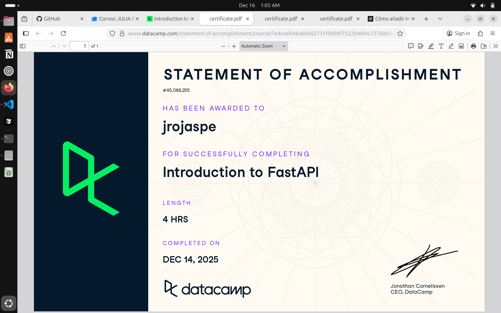

# FastAPI (Proyecto del Modulo de github)

- Nombre: Julia Rojas Pereyra
- Usuario de GitHub: JuliaRojasPe
- Fecha de entrega: 15/12/25

## Curso elegido (marca uno)
- [ ] Udemy
- [x] Data Camp

## Evidencia
- Link(s): https://www.datacamp.com/completed/statement-of-accomplishment/course/7e4ea6b46a60b82731f0098f7522b48fec7370da?utm_medium=organic_social&utm_campaign=sharewidget&utm_content=soa&utm_source=copylink 
- Captura(s): 

> Debe aparecer tu nombre o usuario de GitHub de forma clara.