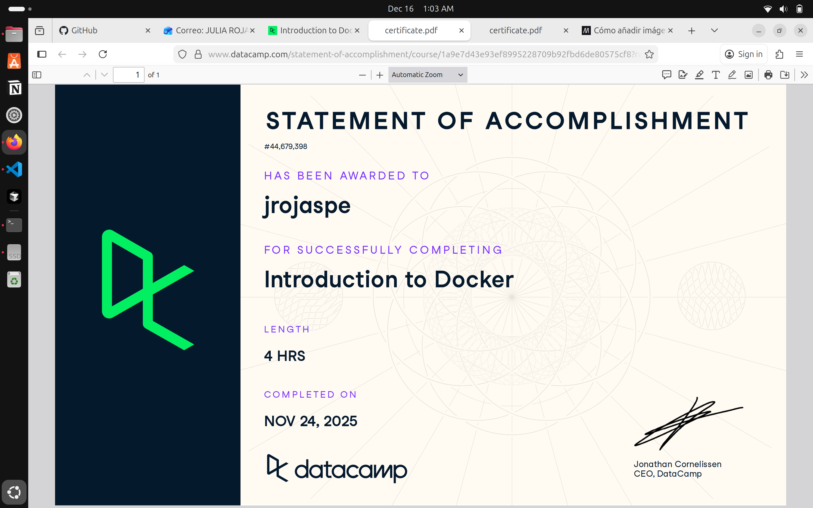

# Docker (Proyecto del módulo de docker)

- Nombre: Julia Rojas Pereyra
- Usuario de GitHub: JuliaRojasPe
- Fecha de entrega: 15/12/25

## Curso elegido (marca uno)
- [ ] Udemy (.1 decimas extras por este): https://www.udemy.com/course/docker-essentials/
- [x] Data Camp (hay que hacer 2):
  - https://app.datacamp.com/learn/courses/introduction-to-docker
  - https://app.datacamp.com/learn/courses/intermediate-docker
- [ ] Udemy (.3 decimas extras): https://www.udemy.com/course/containers-101/

## Evidencia
- Link(s): https://www.datacamp.com/completed/statement-of-accomplishment/course/1a9e7d43e93ef8995228709b92fbd6de80575cf8?utm_medium=organic_social&utm_campaign=sharewidget&utm_content=soa&utm_source=copylink

https://www.datacamp.com/completed/statement-of-accomplishment/course/7a6765e690648cfe75eb89b3f3090a699372fd76?utm_medium=organic_social&utm_campaign=sharewidget&utm_content=soa&utm_source=copylink

- Captura(s): 

> Debe aparecer tu nombre o usuario de GitHub de forma clara. Si eliges la opción de Data Camp, sube evidencia de ambos cursos.

