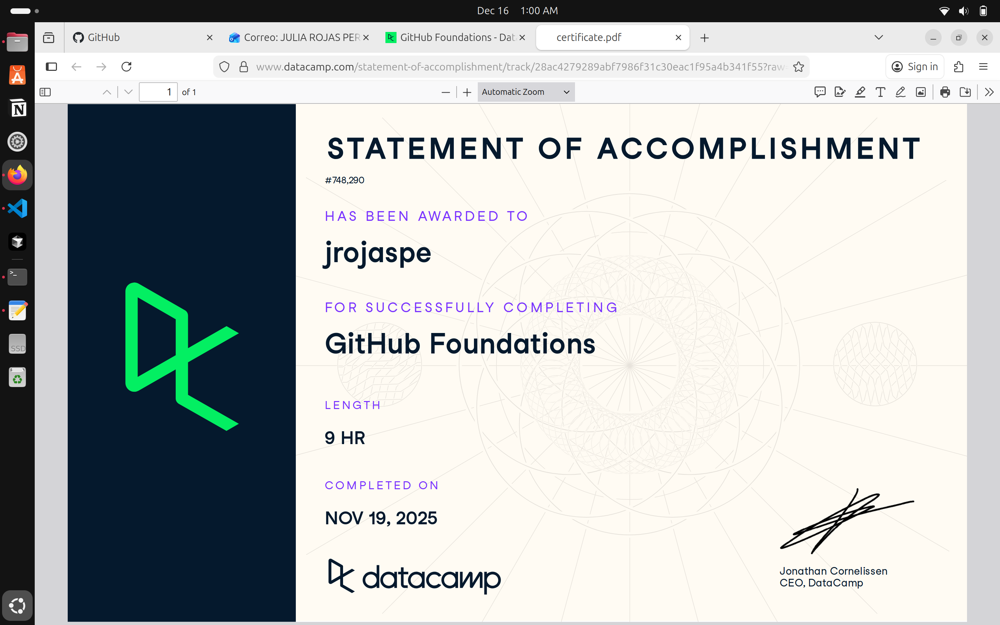

# Github (Proyecto del Modulo de github)

- Nombre: Julia Rojas Pereyra
- Usuario de GitHub: JuliaRojasPe
- Fecha de entrega: 15/12/25

## Curso elegido (marca uno)
- [ ] Udemy: https://www.udemy.com/course/git-expert-4-hours/
- [x] Data Camp: https://app.datacamp.com/learn/skill-tracks/github-foundations

## Evidencia
- Link(s): https://www.datacamp.com/completed/statement-of-accomplishment/track/28ac4279289abf7986f31c30eac1f95a4b341f55?utm_medium=organic_social&utm_campaign=sharewidget&utm_content=soa&utm_source=copylink 
- Captura(s): 

> Debe aparecer tu nombre o usuario de GitHub de forma clara.

