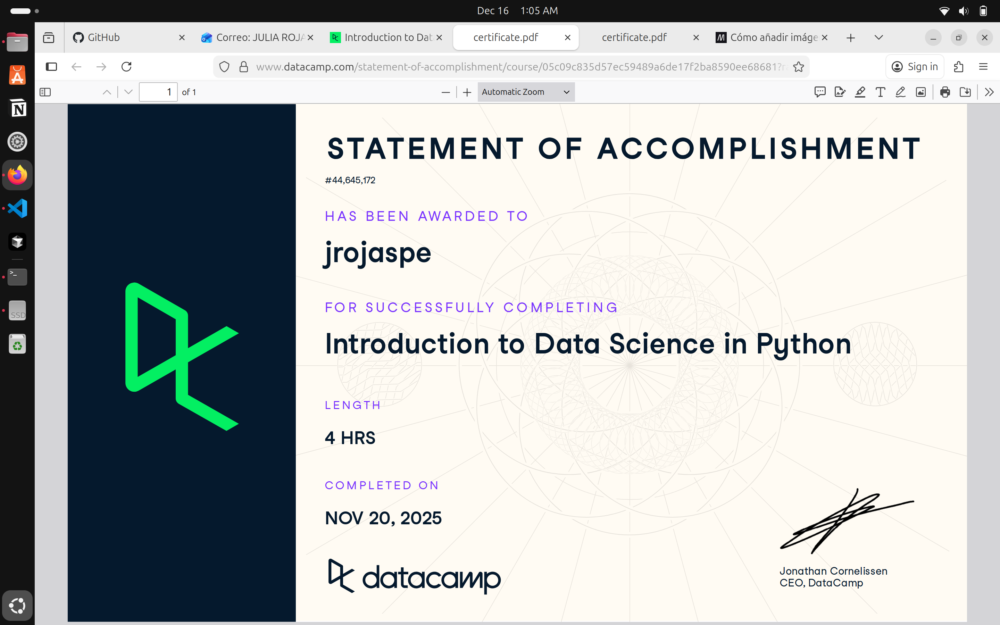

# Python (Proyecto del modulo de python)

- Nombre: Julia Rojas
- Usuario de GitHub: JuliaRojasPe
- Fecha de entrega: 15/12/25

## Curso elegido (marca uno)
- [ ] Udacity: https://www.udacity.com/enrollment/ud1110 (gratis)
- [x] Data Camp: https://app.datacamp.com/learn/courses/intro-to-python-for-data-science

## Evidencia
- Link(s): https://www.datacamp.com/completed/statement-of-accomplishment/course/05c09c835d57ec59489a6de17f2ba8590ee68681?utm_medium=organic_social&utm_campaign=sharewidget&utm_content=soa&utm_source=copylink 

- Captura(s): 

> Debe aparecer tu nombre o usuario de GitHub de forma clara.

