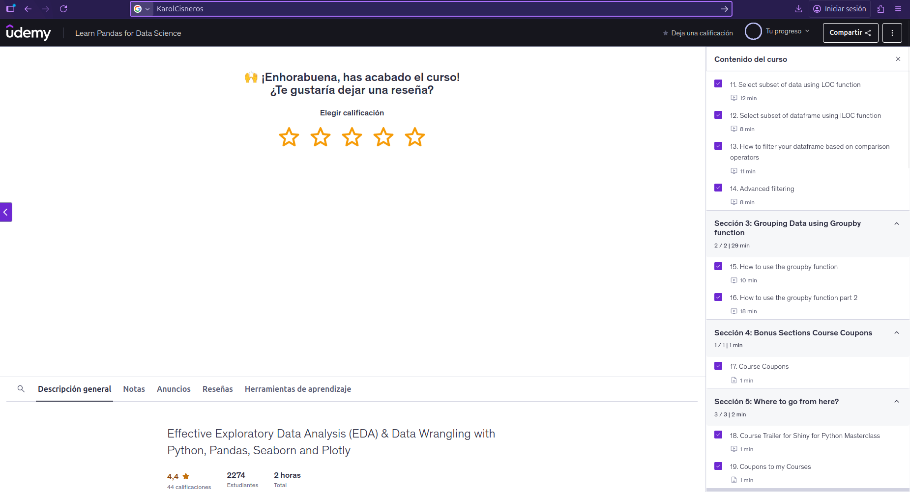

# Pandas (Proyecto modulo de Pandas)

- Nombre: Karol Josafat Cisneros Suárez
- Usuario de GitHub:KarolCisneros
- Fecha de entrega: 10 de noviembre de 2025

## Curso elegido (marca uno)

- [X] Udemy: https://www.udemy.com/course/learn-data-wrangling-using-python-and-pandas-free-course/
- [ ] Udemy: https://www.udemy.com/course/applied-python-pandas/
- [ ] Data camp: https://app.datacamp.com/learn/courses/data-manipulation-with-pandas

## Evidencia
- Link(s): 
- Captura(s): 

> Debe aparecer tu nombre o usuario de GitHub de forma clara.

