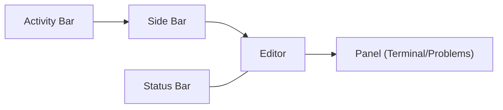
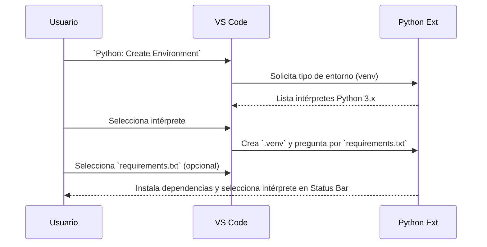
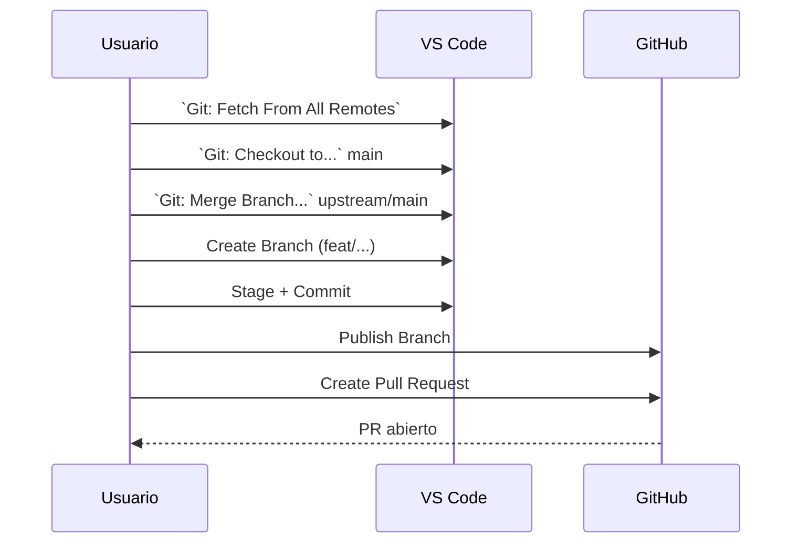

# Notas sobre VSCODE

### VS CODE, qué es?
Es un lector de código moderno, con interfaz gráfica, acceso a extensiones, etc.

Tabla de referencia de formatos usados en esta guía

| Tipo | Cómo lo verás | Ejemplo |
|---|---|---|
| Comando de Paleta | `Nombre: Subcomando` | `View: Toggle Terminal` |
| Atajo de teclado | `Ctrl+Tecla` (o `Ctrl+K Ctrl+S`) | `Ctrl+Shift+P` |
| Ruta de menú | `Menú → Submenú` | `View → Explorer` |
| Archivo/Carpeta | `ruta/o/archivo` | `students/{tu_carpeta}/vscode/` |

Cómo mostrar/ocultar cada parte (elige Menú o Paleta; atajos dependen del sistema):
- Explorer: Menú View → Explorer, o `Ctrl+Shift+P` → "View: Show Explorer".
- Terminal: Menú Terminal → New Terminal, o `Ctrl+Shift+P` → "View: Toggle Terminal".
- Problems: Menú View → Problems, o `Ctrl+Shift+P` → "View: Toggle Problems".
- Extensions: Menú View → Extensions, o `Ctrl+Shift+P` → "Extensions: View Extensions".
- Restablecer diseño: `Ctrl+Shift+P` → "View: Reset Workbench Layout".

## Diagramas

Diagrama del layout (simplificado)

---

Diagrama: crear entorno `venv` desde la Paleta

---

Diagrama: flujo de actualización y PR GIT

