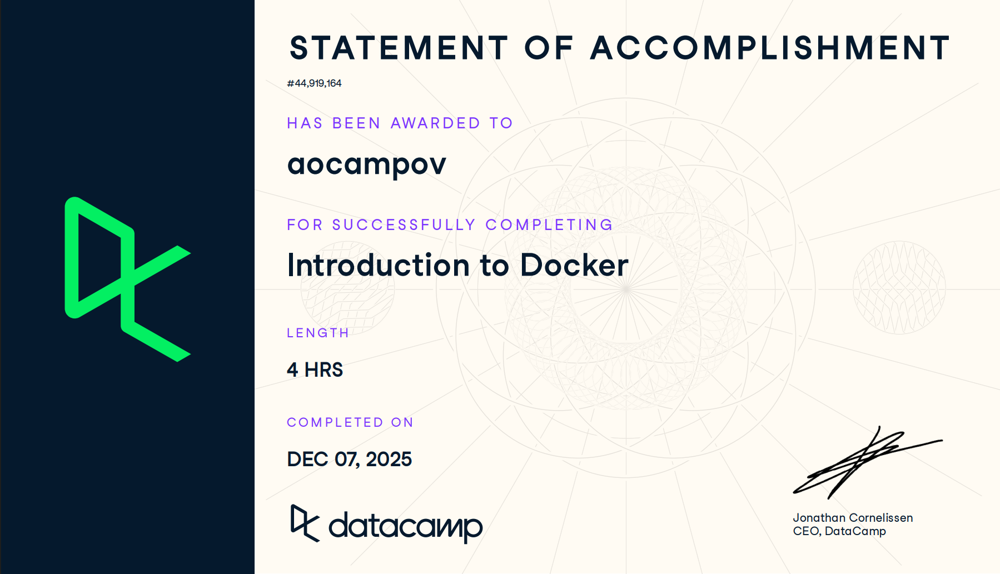

# Docker (Proyecto del módulo de docker)

- Nombre:
- Usuario de GitHub:
- Fecha de entrega:

## Curso elegido (marca uno)
- [ ] Udemy (.1 decimas extras por este): https://www.udemy.com/course/docker-essentials/
- [X] Data Camp (hay que hacer 2):
  - https://app.datacamp.com/learn/courses/introduction-to-docker
  - https://app.datacamp.com/learn/courses/intermediate-docker
- [ ] Udemy (.3 decimas extras): https://www.udemy.com/course/containers-101/

## Evidencia
- Link(s): 
1. https://www.datacamp.com/completed/statement-of-accomplishment/course/30127a2857c01328de5fe85298ac465420a674b1 
- Captura(s): 
2. https://www.datacamp.com/completed/statement-of-accomplishment/course/7471de1c286f91e6dd2f254a7c23af03a9c5155a?utm_medium=organic_social&utm_campaign=sharewidget&utm_content=soa&utm_source=copylink 

- Captura(s):

> Debe aparecer tu nombre o usuario de GitHub de forma clara. Si eliges la opción de Data Camp, sube evidencia de ambos cursos.

