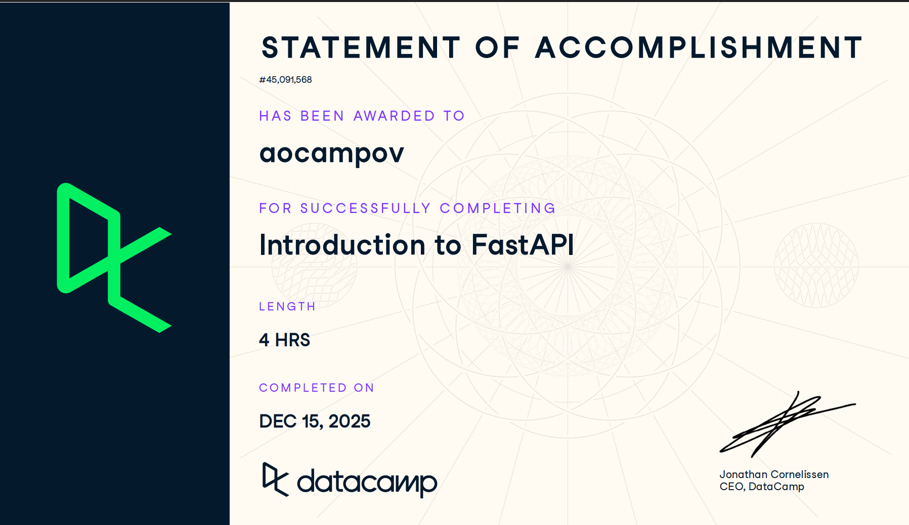

# Docker (Proyecto del módulo de docker)

- Nombre:
- Usuario de GitHub:
- Fecha de entrega:

El curso esta en Datacamp en el grupo, revisa como entrar esta como tarea asignada del datacamp.
## Evidencia
- Link(s): https://www.datacamp.com/completed/statement-of-accomplishment/course/c5bebc8643d6925893521fefeb1c5fc6cdda3369?utm_medium=organic_social&utm_campaign=sharewidget&utm_content=soa&utm_source=copylink 
- Captura(s):

> Debe aparecer tu nombre o usuario de GitHub de forma clara. Si eliges la opción de Data Camp, sube evidencia de ambos cursos.

