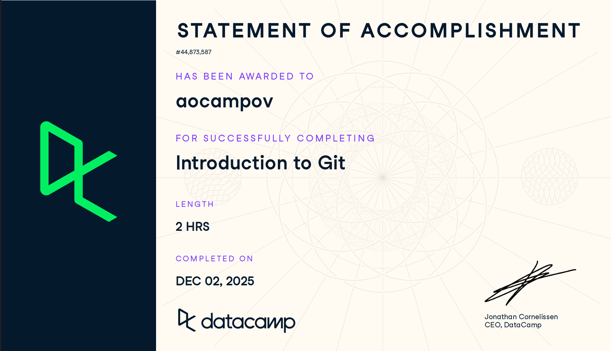
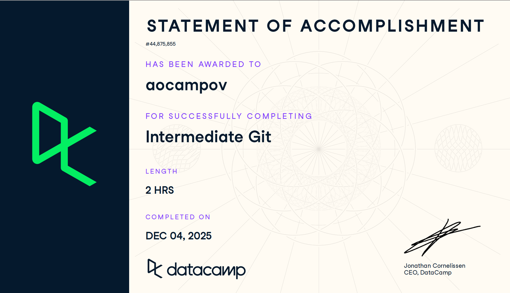

# Github (Proyecto del Modulo de github)

- Nombre:
- Usuario de GitHub:
- Fecha de entrega:

## Curso elegido (marca uno)
- [ ] Udemy: https://www.udemy.com/course/git-expert-4-hours/
- [X] Data Camp: https://app.datacamp.com/learn/skill-tracks/github-foundations

## Evidencia
- Link(s): 

    Introduccion a git: https://www.datacamp.com/completed/statement-of-accomplishment/course/f0c9bf20942c85e0b2c38492a1e1d8a2dc33152e 

    Intermediate Git: https://www.datacamp.com/completed/statement-of-accomplishment/course/0cd48febb868735591938af11e3273c763c4e3e3 

    - Extra: Intermediate GitHub Concepts: https://www.datacamp.com/completed/statement-of-accomplishment/course/0e631fc7efae8ba56460dc6a836eb590faaa0cae 
- Captura(s):

    Introduccion a git:
    

    Intermediate Git:
    

    Extra - Intermediate GitHub Concepts:
     

> Debe aparecer tu nombre o usuario de GitHub de forma clara.

