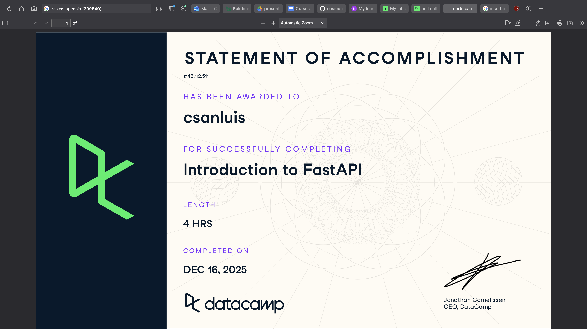

# Docker (Proyecto del módulo de docker)

- Nombre: André San Luis
- Usuario de GitHub: casiopeosis
- Fecha de entrega: 15 de diciembre

El curso esta en Datacamp en el grupo, revisa como entrar esta como tarea asignada del datacamp.
## Evidencia
- Link(s):
- Captura(s):  No sé por qué dice 16 de diciembre, de todas maneras este commit es del 15 de dicembre a las 23hrs

> Debe aparecer tu nombre o usuario de GitHub de forma clara. Si eliges la opción de Data Camp, sube evidencia de ambos cursos.

