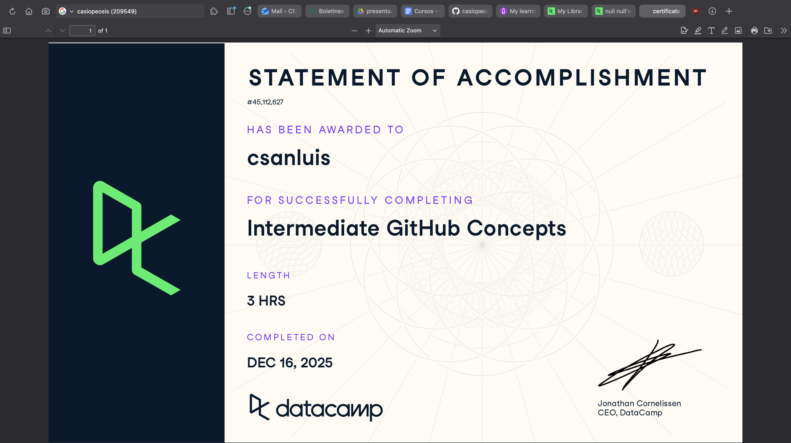

# Github (Proyecto del Modulo de github)

- Nombre: André San Luis
- Usuario de GitHub: casiopeosis
- Fecha de entrega: 15 de diciembre

## Curso elegido (marca uno)
- [ ] Udemy: https://www.udemy.com/course/git-expert-4-hours/
- [X] Data Camp: https://app.datacamp.com/learn/skill-tracks/github-foundations
- [X] Data Camp: https://app.datacamp.com/learn/courses/intermediate-github-concepts

## Evidencia
- Link(s):
- Captura(s):

> Debe aparecer tu nombre o usuario de GitHub de forma clara.

