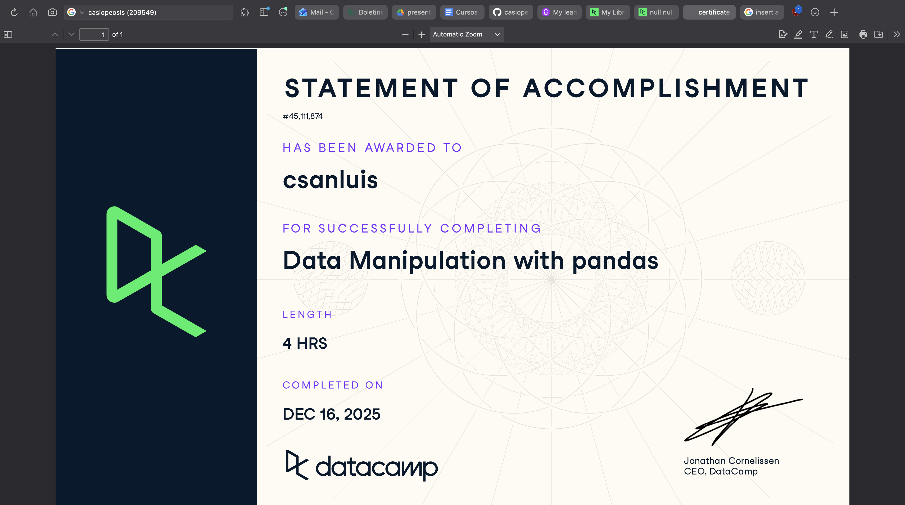

# Pandas (Proyecto modulo de Pandas)

- Nombre: André San Luis
- Usuario de GitHub: casiopeosis
- Fecha de entrega: 15 de diciembre

## Curso elegido (marca uno)
- [ ] Udemy: https://www.udemy.com/course/learn-data-wrangling-using-python-and-pandas-free-course/
- [ ] Udemy: https://www.udemy.com/course/applied-python-pandas/
- [X] Data camp: https://app.datacamp.com/learn/courses/data-manipulation-with-pandas

## Evidencia
- Link(s):
- Captura(s):

> Debe aparecer tu nombre o usuario de GitHub de forma clara.

