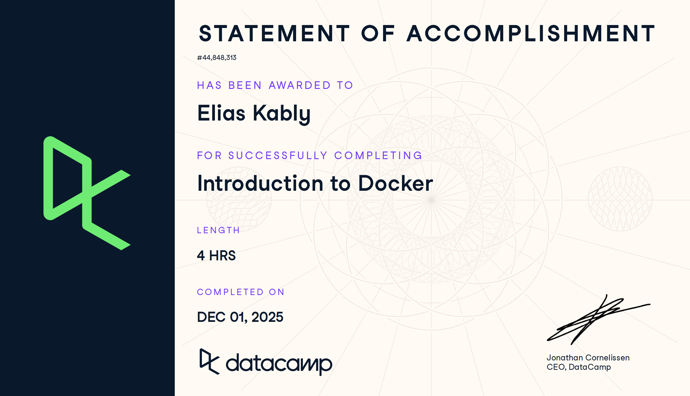
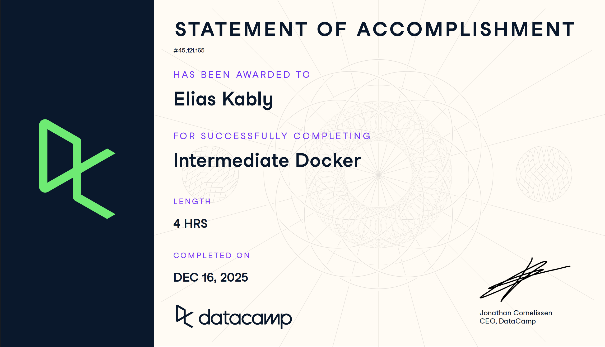

# Docker (Proyecto del módulo de docker)

- Nombre: Elias Kably
- Usuario de GitHub: ekab-hub
- Fecha de entrega: 16/12/25

## Curso elegido (marca uno)
- [ ] Udemy (.1 decimas extras por este): https://www.udemy.com/course/docker-essentials/
- [ X ] Data Camp (hay que hacer 2):
  - https://app.datacamp.com/learn/courses/introduction-to-docker
  - https://app.datacamp.com/learn/courses/intermediate-docker
- [ ] Udemy (.3 decimas extras): https://www.udemy.com/course/containers-101/

## Evidencia
- Link(s): 
  - https://www.datacamp.com/statement-of-accomplishment/course/b67502045b9eb76ac20b7aec5d11ddfc914c3587?raw=1
  - https://www.datacamp.com/statement-of-accomplishment/course/72c5ca3fb6c51e0a581c624f188f1202d6811f75?raw=1

- Captura(s):

> Debe aparecer tu nombre o usuario de GitHub de forma clara. Si eliges la opción de Data Camp, sube evidencia de ambos cursos.

