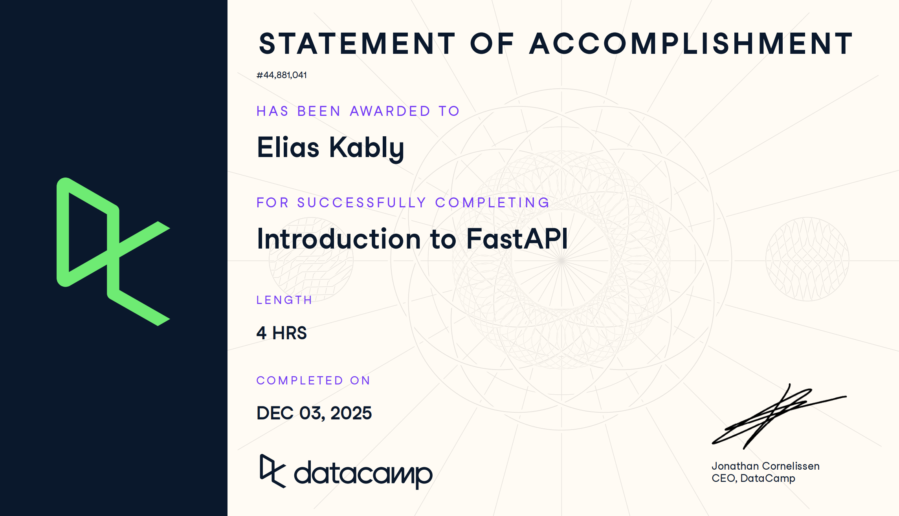

# FastAPI (Proyecto del modulo de fastAPI)

- Nombre: Elias Kably
- Usuario de GitHub: ekab-hub
- Fecha de entrega: 16/12/25

## Curso elegido (marca uno)
- [ X ] Data Camp: https://app.datacamp.com/learn/courses/introduction-to-fastapi

## Evidencia
- Link(s): https://www.datacamp.com/statement-of-accomplishment/course/40aeb92b3076bfe28ca44adbc2e8b884d87c179a?raw=1
- Captura(s):

> Debe aparecer tu nombre o usuario de GitHub de forma clara.

