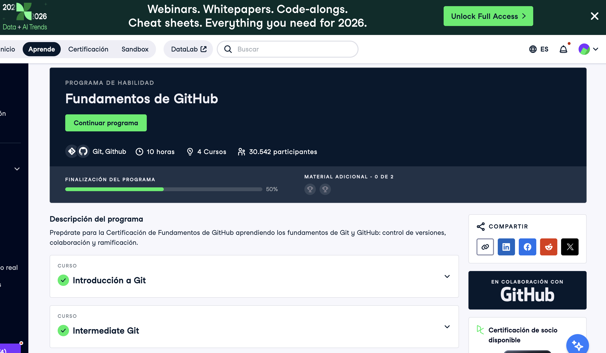

# Github (Proyecto del Modulo de github)

- Nombre: Elias Kably 
- Usuario de GitHub: ekab-hub
- Fecha de entrega: 16/12/25

## Curso elegido (marca uno)
- [ ] Udemy: https://www.udemy.com/course/git-expert-4-hours/
- [ X ] Data Camp: https://app.datacamp.com/learn/skill-tracks/github-foundations

## Evidencia
- Link(s):
- Captura(s): 

> Debe aparecer tu nombre o usuario de GitHub de forma clara.

