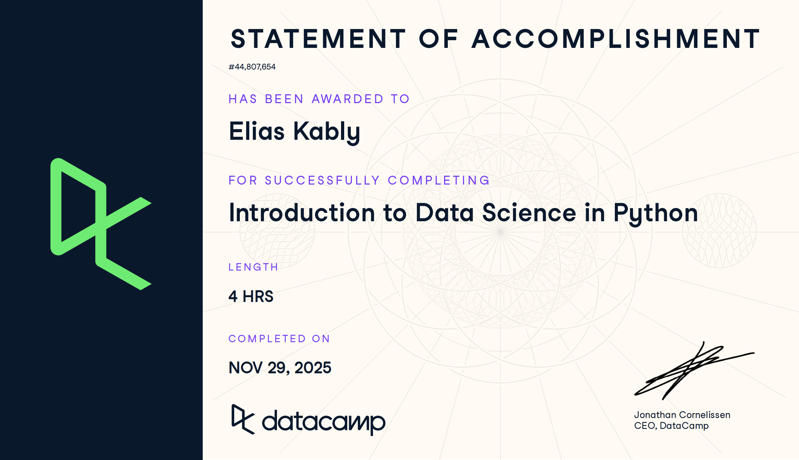

# Python (Proyecto del modulo de python)

- Nombre: Elias Kably
- Usuario de GitHub: ekab-hub
- Fecha de entrega: 16/12/25

## Curso elegido (marca uno)
- [ ] Udacity: https://www.udacity.com/enrollment/ud1110 (gratis)
- [ X ] Data Camp: https://app.datacamp.com/learn/courses/intro-to-python-for-data-science

## Evidencia
- Link(s): https://www.datacamp.com/statement-of-accomplishment/course/4041ddb291176b02dea9f805072086225c6b49ef?raw=1
- Captura(s):

> Debe aparecer tu nombre o usuario de GitHub de forma clara.

