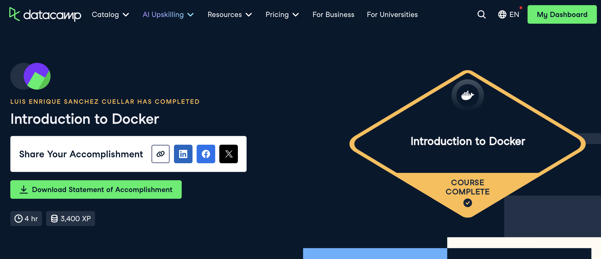
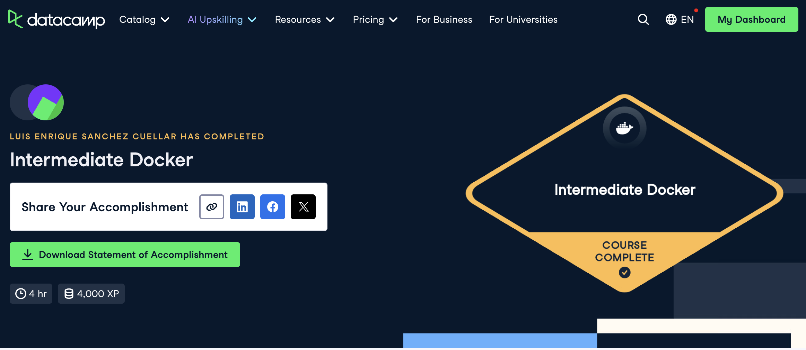

# Docker (Proyecto del módulo de docker)

- Nombre: Luis Enrique Sánchez Cuellar
- Usuario de GitHub: luiscuellar31
- Fecha de entrega: 6 de noviembre de 2025

## Curso elegido (marca uno)
- [ ] Udemy (.1 decimas extras por este): https://www.udemy.com/course/docker-essentials/
- [X] Data Camp (hay que hacer 2):
  - https://app.datacamp.com/learn/courses/introduction-to-docker
  - https://app.datacamp.com/learn/courses/intermediate-docker
- [ ] Udemy (.3 decimas extras): https://www.udemy.com/course/containers-101/

## Evidencia
- Link 1: https://www.datacamp.com/completed/statement-of-accomplishment/course/b4df0077a4fe98b544501834fbc23ac657c35a5e
- Link 2: https://www.datacamp.com/completed/statement-of-accomplishment/course/4ade73e98fefc41683a49f3e9feaf68ff4416cc6
- Captura 1: 
- Captura 2: 
> Debe aparecer tu nombre o usuario de GitHub de forma clara. Si eliges la opción de Data Camp, sube evidencia de ambos cursos.

