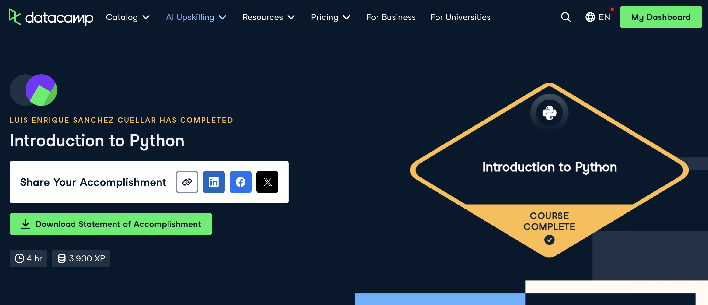

# Python (Proyecto del modulo de python)

- Nombre: Luis Enrique Sánchez Cuellar
- Usuario de GitHub: luiscuellar31
- Fecha de entrega: 7 de noviembre 2025

## Curso elegido (marca uno)
- [ ] Udacity: https://www.udacity.com/enrollment/ud1110 (gratis)
- [X] Data Camp: https://app.datacamp.com/learn/courses/intro-to-python-for-data-science

## Evidencia
- Link(s): https://www.datacamp.com/completed/statement-of-accomplishment/course/012582654672764bd1209857a3bd35d37c87f7e8
- Captura(s): 

> Debe aparecer tu nombre o usuario de GitHub de forma clara.

