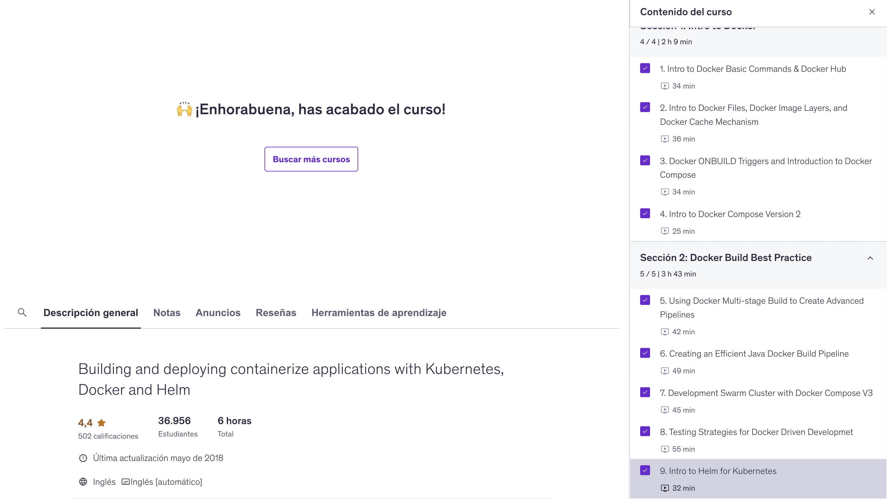

# Docker (Proyecto del módulo de docker)

- Nombre: Ana Paola Carmona Méndez
- Usuario de GitHub: paooCaar
- Fecha de entrega: 15/dic/2025

## Curso elegido (marca uno)
- [x] Udemy (.1 decimas extras por este): https://www.udemy.com/course/docker-essentials/
- [solo hice el primero ] Data Camp (hay que hacer 2):
  - https://app.datacamp.com/learn/courses/introduction-to-docker
  - https://app.datacamp.com/learn/courses/intermediate-docker
- [x] Udemy (.3 decimas extras): https://www.udemy.com/course/containers-101/

## Evidencia
- Link(s): https://www.datacamp.com/completed/statement-of-accomplishment/course/6af8520db46f34da5ddbca730fdf4fcef5db6931
- Captura(s):

> Debe aparecer tu nombre o usuario de GitHub de forma clara. Si eliges la opción de Data Camp, sube evidencia de ambos cursos.

