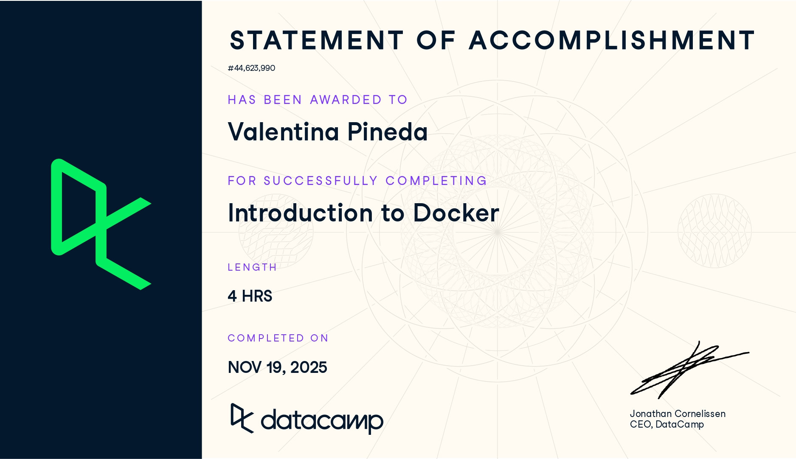

# Docker (Proyecto del módulo de docker)

- Nombre: Valentina Pineda
- Usuario de GitHub: vpinedab
- Fecha de entrega: 14 de diciembre de 2025

## Curso elegido (marca uno)
- [ ] Udemy (.1 decimas extras por este): https://www.udemy.com/course/docker-essentials/
- [✓] Data Camp (hay que hacer 2):
  - https://app.datacamp.com/learn/courses/introduction-to-docker
  - https://app.datacamp.com/learn/courses/intermediate-docker
- [ ] Udemy (.3 decimas extras): https://www.udemy.com/course/containers-101/

## Evidencia
- Link(s): 
  - https://www.datacamp.com/completed/statement-of-accomplishment/course/d2688cdc152c4671aa64b7ae8e5cb037a15a1be4?utm_medium=organic_social&utm_campaign=sharewidget&utm_content=soa&utm_source=copylink
  - https://www.datacamp.com/completed/statement-of-accomplishment/course/8527f206af73a9a8f0edf91b8a5dc110e2c8d1d6?utm_medium=organic_social&utm_campaign=sharewidget&utm_content=soa&utm_source=copylink

- Captura(s): 

> Debe aparecer tu nombre o usuario de GitHub de forma clara. Si eliges la opción de Data Camp, sube evidencia de ambos cursos.

