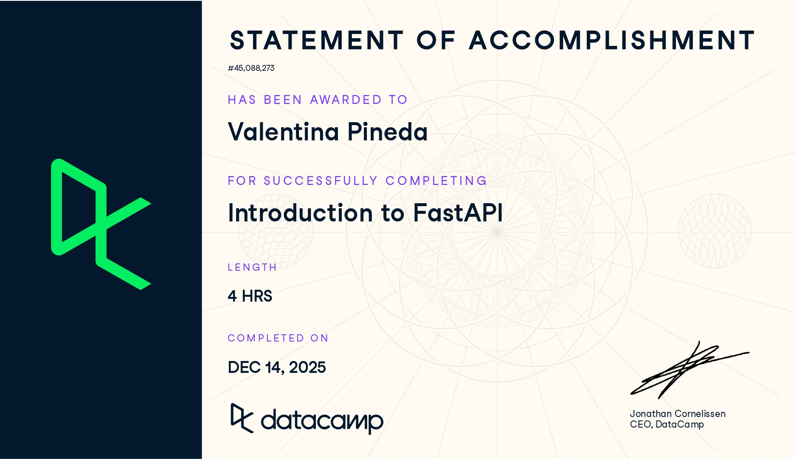

# FastAPI (Proyecto del módulo de FastAPI)

- Nombre: Valentina Pineda Barrón
- Usuario de GitHub: vpinedab
- Fecha de entrega: 14 de diciembre de 2025

El curso esta en Datacamp en el grupo, revisa como entrar esta como tarea asignada del datacamp.
## Evidencia
- Link(s): https://www.datacamp.com/completed/statement-of-accomplishment/course/e79c7bfc142dde8e7e89b9c04acb5288fc752928?utm_medium=organic_social&utm_campaign=sharewidget&utm_content=soa&utm_source=copylink
- Captura(s):

> Debe aparecer tu nombre o usuario de GitHub de forma clara. Si eliges la opción de Data Camp, sube evidencia de ambos cursos.

