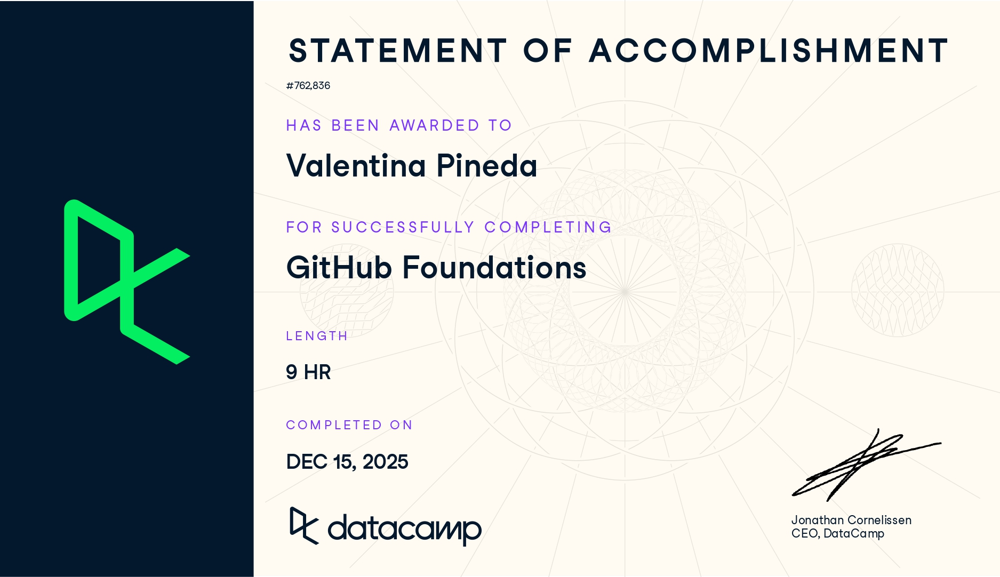
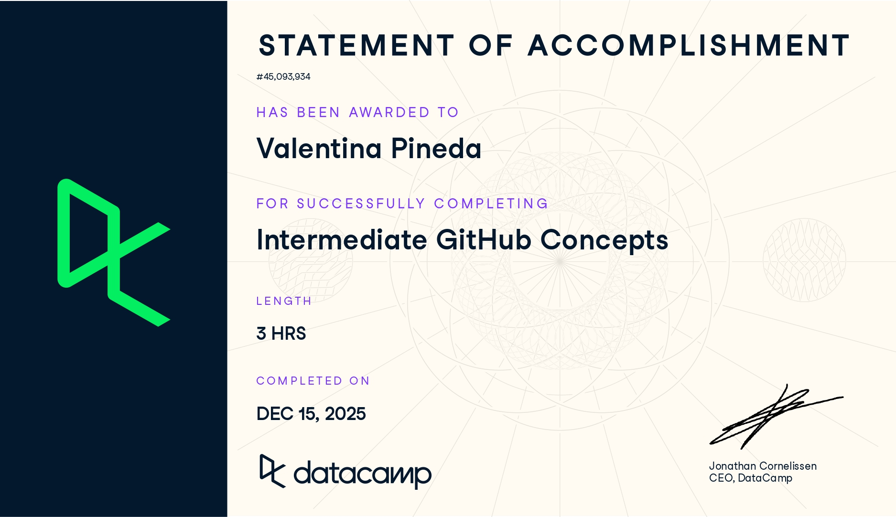

# Github (Proyecto del Modulo de github)

- Nombre: Valentina Pineda 
- Usuario de GitHub: vpinedab
- Fecha de entrega: 15 de noviembre de 2025

## Curso elegido (marca uno)
- [ ] Udemy: https://www.udemy.com/course/git-expert-4-hours/
- [✓] Data Camp: https://app.datacamp.com/learn/skill-tracks/github-foundations

## Evidencia
- Link(s): https://www.datacamp.com/completed/statement-of-accomplishment/track/a22910488468257b123291c46aa94a74ffd41a40?utm_medium=organic_social&utm_campaign=sharewidget&utm_content=soa&utm_source=copylink
- Captura(s): 

### Curso Extra: Intermediate GitHub Concepts
- Link: https://www.datacamp.com/completed/statement-of-accomplishment/course/fcfb74cce7726b113447ad8eeec854ad83853030?utm_medium=organic_social&utm_campaign=sharewidget&utm_content=soa&utm_source=copylink
- Captura: 

> Debe aparecer tu nombre o usuario de GitHub de forma clara.

