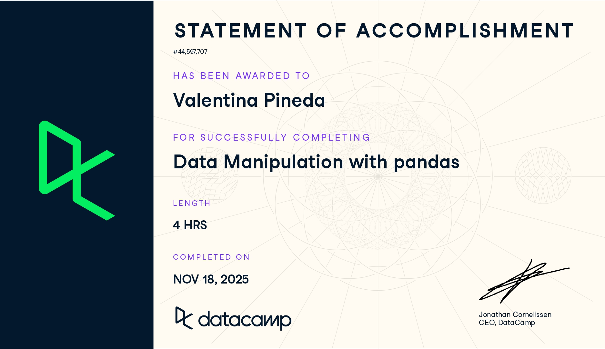

# Pandas (Proyecto modulo de Pandas)

- Nombre: Valentina Pineda
- Usuario de GitHub: vpinedab
- Fecha de entrega: 18 de noviembre de 2025

## Curso elegido (marca uno)
- [ ] Udemy: https://www.udemy.com/course/learn-data-wrangling-using-python-and-pandas-free-course/
- [ ] Udemy: https://www.udemy.com/course/applied-python-pandas/
- [✓] Data camp: https://app.datacamp.com/learn/courses/data-manipulation-with-pandas

## Evidencia
- Link(s): https://www.datacamp.com/completed/statement-of-accomplishment/course/791c958256a163fee9a97f701ac691ecab44528c?utm_medium=organic_social&utm_campaign=sharewidget&utm_content=soa&utm_source=copylink 
- Captura(s): 

> Debe aparecer tu nombre o usuario de GitHub de forma clara.

